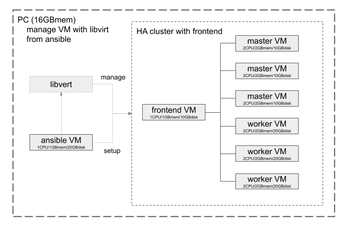

Ansible Playbooks
=================

# boiler-plate
Template for Ansible Playbooks

# libvirt
Manage VMs for kubernetes clusters or devstack using `libvirt`.

# kubeadm
Setup `kubeadm` into VMs created by `libvirt` playbook for `single` or `multi` settings.
And bootstrap VMs as kubernetes cluster.

# devkube
Create simple kubernetes cluster and install development environment on VMs created by `libvirt` playbook for `allinone` settings.
