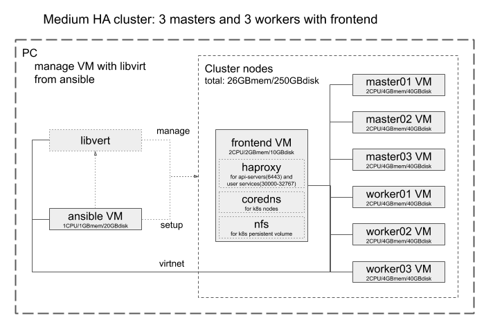

Setup kubernetes cluster
========================

This scripts setup kubernetes cluster Ubuntu VMs from cloud image using libvirt.

# How to use

Before run playbook, run `ssh-agent bash` and `ssh-add <ssh key file>` to access `libvirt_host` via ssh.

## Install dependencies

Run playbook with `-k` option for input ssh passphrase and `-K` option for `sudo`.
```
ansible-playbook -i ../libvirt/dist/<single|minimum|medium> site.yaml -k -K
```

## Bootstrap cluster

Run playbook with inventory file created by `libvirt` playbook.
Use `-k` option for input ssh passphrase and `-K` option for `sudo` if you need.
```
ansible-playbook -i ../libvirt/dist/<stage>-<cluster_type> bootstrap.yaml -k -K
```




## Use DNS server on `frontend` instance to access inside cluster, e.g. your services.

Add record into `/etc/hosts` and reboot your machine.

```
# k8s HA cluster frontend with haproxy
192.168.100.40 master.<cluster_type>.<stage>.<domain>
```

## Sample manifests

### To check cluster with adding nginx service

Login to any node with SSH.
```
sudo -i
export KUBECONFIG=/etc/kubernetes/admin.conf
# Copy `nginx-sample.yaml` from `playbooks/kubeadm/samples/` to any node.
kubectl apply -f nginx-sample.yaml
kubectl get svc/nginx
```

Then, access the nginx service from web client to following:
`http://master.<cluster_type>.<stage>.<domain>:31080`

### Use ingress-nginx controller

Deploy ingress-nginx controller running `kubectl apply -f samples/ingress-nginx-controller.yaml`.
This manifest is downloaded from `https://raw.githubusercontent.com/kubernetes/ingress-nginx/master/deploy/static/provider/baremetal/deploy.yaml` and added `nodePort: 30080` and `nodePort: 30443` for its service.

Deploy ingress object from `sample/nginx-ingress.yaml`

To access nginx service using donamin name, add record into `/etc/hosts` in your local machine.
```
192.168.100.40 nginx.<cluster_type>.<stage>.<domain>
```
Also, add DNS record as follow at frontend host:
```
etcdctl set /coredns/<domain>/<stage>/<cluster_type>/nginx '"host": "192.168.100.40"'
```
And add haproxy setting into `/opt/haproxy/haproxy.cfg` as follow:
```
frontend web
    bind *:80
    use_backend nginx if { hdr(host) -i nginx.<cluster_type>.<stage>.<domain> }

backend nginx
    server master01 192.168.100.41:30080 check inter 5s
    server master02 192.168.100.42:30080 check inter 5s
    server master03 192.168.100.43:30080 check inter 5s
    balance roundrobin
```
And restart `haproxy` container as follow:
```
sudo docker restart haproxy
```
Then, access `http://nginx.<cluster_type>.<stage>.<domain>` from browser.

### Deploy Metrics Server
Same as above, copy files in `playbooks/kubeadm/samples/`.
See `deploy-metrics-server.sh`, download manifest for metrics-server and edit the it.

Then, run following:
* `./deploy-metrics-server.sh`

### Deploy Kubernetes Dashboard

Same as above, copy files in `playbooks/kubeadm/samples/` and run following:
* `./deploy-kubernetes-dashboard.sh`
